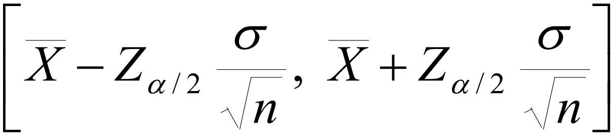
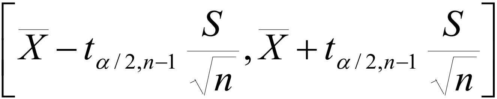
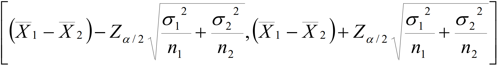
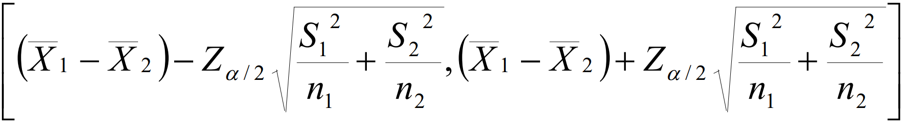
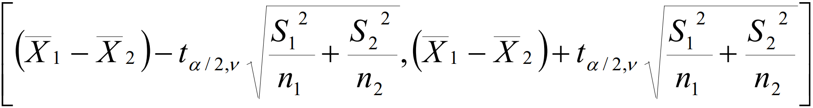
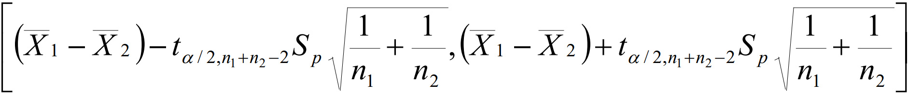
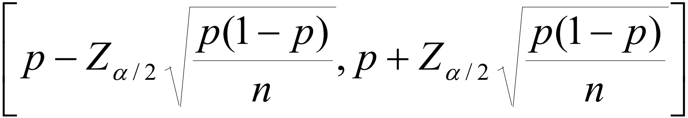
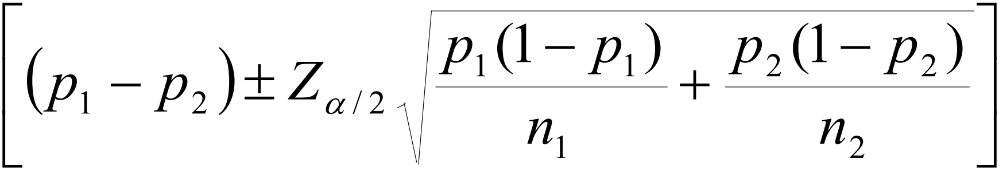
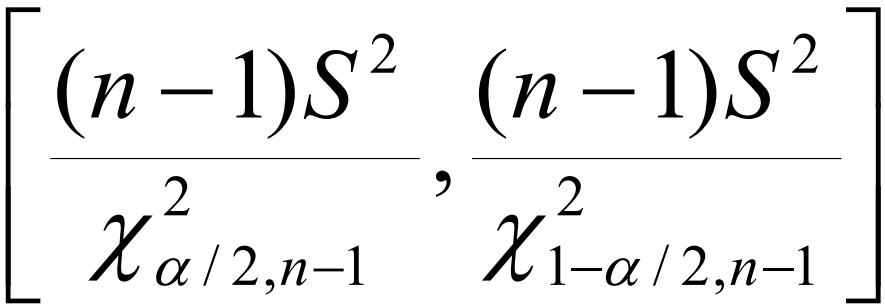
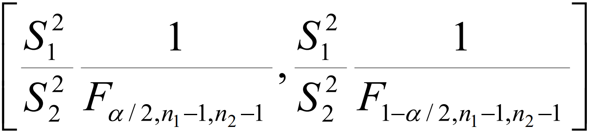

# Calculadora-de-intervalos-de-confianza
Calculadora de intervalos de confianza para la materia de Probabilidad y Estadística de la Escuela Superior de Cómputo (ESCOM-IPN) con la profesora Cañedo Suarez Leticia. 

## Refactorización
La refactorización se encuentra pendiente.

## Intervalos de confianza soportados
### Para una media poblacional (μ)
- Parámetro a estimar (μ)
- Distribución normal, muestra grande y varianza conocida
- Estimador puntual (X̄)


- Parámetro a estimar (μ)
- Dsitribución normal, muestra grande o pequeña y varianza desconocida
- Estimador puntual (X̄)


### Para una diferencia de medias poblacionales (μ₁ - μ₂)
- Parámetro a estimar (μ₁ - μ₂)
- Para dos muestras independientes de poblaciones normales con varianzas conocidas
- Estimador puntual (X̄₁ - X̄₂)


- Parámetro a estimar (μ₁ - μ₂)
- Para dos muestras grandes (n > 30) independientes de poblaciones normales con varianzas diferentes y desconocidas
- Estimador puntual (X̄₁ - X̄₂)


- Parámetro a estimar (μ₁ - μ₂)
- Para dos muestras chicas independientes de poblaciones normales con varianzas diferentes y desconocidas
- Estimador puntual (X̄₁ - X̄₂)


- Parámetro a estimar (μ₁ - μ₂)
- Para dos muestras independientes de poblaciones normales con varianzas iguales y desconocidas
- Estimador puntual (X̄₁ - X̄₂)


### Para una proporción (𝑃)
- Parámetro a estimar (𝑃)
- Para una muestra grande con 𝑃 pequeña 
- Estimador puntual (𝑝)


### Para una diferencia de proporciones (𝑃₁ - 𝑃₂)
- Parámetro a estimar (𝑃₁ - 𝑃₂)
- Para dos muestra grandes e independientes de una distribución normal
- Estimador puntual (𝑝₁ - 𝑝₂)


### Para una varianza poblacional (σ²)
- Parámetro a estimar (σ²)
- Para una muestra cualquiera
- Estimador puntual (𝑠²)


### Para el cociente de varianzas poblacionales (σ₁² / σ₂²)
- Parámetro a estimar (σ₁² / σ₂²)
- Para dos muestras independientes de poblaciones normales
- Estimador puntual (𝑠₁² / 𝑠₂²)


---

## 📁 Estructura de la calculadora
```text
Calculadora-de-intervalos-de-confianza/
├── assets/
│   └── images/
│       ├── interval_case_1.png
│       ├── interval_case_10.png
│       ├── interval_case_2.png
│       ├── interval_case_3.png
│       ├── interval_case_4.png
│       ├── interval_case_5.png
│       ├── interval_case_6.png
│       ├── interval_case_7.png
│       ├── interval_case_8.png
│       └── interval_case_9.png
├── casos/
│   ├── coc_varianzas.py
│   ├── dif_medias.py
│   ├── dif_proporciones.py
│   ├── media.py
│   ├── proporcion.py
│   ├── varianza.py
│   ├── __init__.py
├── config/
│   ├── config.py
│   └── __init__.py
├── docs/
│   └── formulario_Intervalos_de_confianza.pdf
├── src/
│   ├── advertencias.py
│   ├── errores.py
│   ├── utils.py
│   ├── validaciones.py
│   ├── __init__.py 
│   ├── services/
│   │   ├── calculos.py
│   │   └── __init__.py 
│   └── visualization/
│       ├── graficas.py
│       └── __init__.py
├── .gitignore
├── main.py
└── README.md   
```

---

## 🚀 Uso de la calculadora
Desde la raíz del proyecto:
```
py main.py
```